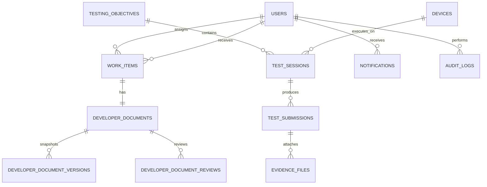

# VoiceShield Console Database Architecture

**Database Engine:** PostgreSQL 16  
**Dialect:** Standard SQL with UUID extension (`uuid-ossp`)  
**Storage & Timestamps:** All datetime fields stored in UTC (`TIMESTAMPTZ`)

---

## 1. Entity-Relationship Overview



---

## 2. Core Tables Schema Definition

### 2.1 `users`
- `id` (UUID PK): Unique identifier
- `email` (VARCHAR 255 UNIQUE): User login email
- `password_hash` (VARCHAR 255): Bcrypt password hash
- `display_name` (VARCHAR 255): User full name
- `role` (VARCHAR 50): `SUPER_ADMIN` | `ADMIN` | `DEVELOPER` | `TESTER`
- `status` (VARCHAR 50): `ACTIVE` | `DISABLED`
- `failed_login_attempts` (INT): Counter for lockout protection
- `locked_until` (TIMESTAMPTZ): Lockout expiration timestamp
- `last_login_at` (TIMESTAMPTZ): Most recent authentication

### 2.2 `work_items` & `work_status_history`
- `id` (UUID PK)
- `title` (VARCHAR 255), `description` (TEXT), `priority` (`LOW`, `MEDIUM`, `HIGH`, `CRITICAL`)
- `status`: `ASSIGNED` ➔ `ACCEPTED` ➔ `IN_PROGRESS` ➔ `DOCUMENTATION_SUBMITTED` ➔ `APPROVED` / `CHANGES_REQUESTED` ➔ `COMPLETED`
- `assigned_to` (UUID FK -> users.id), `assigned_by` (UUID FK -> users.id)
- `work_status_history`: Tracks immutable transitions with `from_status`, `to_status`, `changed_by`, `notes`, `created_at`.

### 2.3 `developer_documents`, `versions`, & `reviews`
- `developer_documents`: Primary active document record linked to `work_items.id`.
- `developer_document_versions`: Immutable content snapshot created upon each submission (`content_snapshot` JSONB).
- `developer_document_reviews`: Review decision (`APPROVED`, `CHANGES_REQUESTED`, `FEEDBACK`) and reviewer comments.

### 2.4 `testing_objectives`, `test_sessions`, & `test_submissions`
- `testing_objectives`: Exploratory testing purposes and targets.
- `test_sessions`: Quick Test execution records linking tester, device, objective, app version, and Android OS version.
- `test_submissions`: Manual testing results with outcomes `PASS`, `FAIL`, `BLOCKED`, `NOT_TESTED`.
- `evidence_files`: Metadata referencing screenshots, recordings, and log files in object storage.

### 2.5 `devices` & `device_status_history`
- `devices`: Compatible test hardware inventory with `status` (`ACTIVE` / `INACTIVE`). Soft deactivation preserved; foreign key constraint protects historical test references from deletion.

### 2.6 `audit_logs` (Append-Only)
- `id` (UUID PK), `event_type`, `actor_id`, `actor_role`, `action`, `resource_type`, `resource_id`, `request_id`, `ip_address`, `user_agent`, `metadata`, `created_at`.
- Strict application-layer immutability with no update or delete privileges.

---

## 3. Database Indexes

```sql
CREATE INDEX idx_users_email ON users(email);
CREATE INDEX idx_work_items_assigned_to ON work_items(assigned_to);
CREATE INDEX idx_work_items_status ON work_items(status);
CREATE INDEX idx_testing_objectives_assigned_to ON testing_objectives(assigned_to);
CREATE INDEX idx_test_submissions_tester_id ON test_submissions(tester_id);
CREATE INDEX idx_test_submissions_status ON test_submissions(status);
CREATE INDEX idx_audit_logs_actor_id ON audit_logs(actor_id);
CREATE INDEX idx_audit_logs_event_type ON audit_logs(event_type);
CREATE INDEX idx_notifications_user_id ON notifications(user_id, read);
```

---

## 4. Connection Pool Configuration

| Parameter | Recommended Dev | Recommended Production | Description |
|:---|:---:|:---:|:---|
| `DB_POOL_MIN` | 2 | 5 | Minimum idle connections maintained in pool |
| `DB_POOL_MAX` | 10 | 30 | Maximum concurrent active connections |
| `DB_CONNECTION_TIMEOUT` | 5000ms | 5000ms | Fail fast timeout for acquiring connection |
| `DB_IDLE_TIMEOUT` | 30000ms | 30000ms | Release idle connections after 30 seconds |
