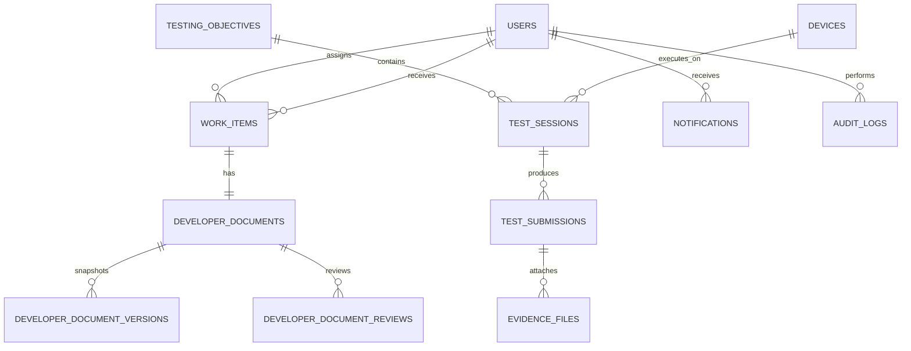

# VoiceShield Console Database Architecture & AWS RDS Specification

**Database Engine:** PostgreSQL (AWS RDS PostgreSQL 18.3 compatible)  
**Target Host:** `voiceshield-prod-db.chcku4ke2u3b.ap-south-2.rds.amazonaws.com`  
**Region:** `ap-south-2` (Hyderabad)  
**Database Name:** `voiceshield_console`  
**Application DB User:** Dedicated Console user (e.g. `voiceshield_console_user`)  
**Dialect:** Standard SQL with UUID extension (`uuid-ossp`)  
**Storage & Timestamps:** All datetime fields stored in UTC (`TIMESTAMPTZ`)

---

## 1. Logical Isolation & Architecture

VoiceShield Console operates in its own dedicated database (`voiceshield_console`) within the AWS RDS instance:

```text
AWS RDS Instance (voiceshield-prod-db.chcku4ke2u3b.ap-south-2.rds.amazonaws.com)
    └── Database: voiceshield_console
          ├── Table: schema_migrations
          ├── Table: users
          ├── Table: refresh_tokens
          ├── Table: work_items
          ├── Table: work_assignments
          ├── Table: work_status_history
          ├── Table: developer_documents
          ├── Table: developer_document_versions
          ├── Table: developer_document_reviews
          ├── Table: devices
          ├── Table: device_status_history
          ├── Table: testing_objectives
          ├── Table: test_sessions
          ├── Table: test_submissions
          ├── Table: test_reviews
          ├── Table: evidence_files
          ├── Table: audit_logs
          ├── Table: database_exports
          ├── Table: notifications
          ├── Table: database_backups
          └── Table: database_users
```

> [!IMPORTANT]
> The Console database is strictly separated from any core VoiceShield backend databases. The backend never uses administrative credentials (`vs_admin` / `postgres`) and only connects to `voiceshield_console`.

---

## 2. Entity-Relationship Overview



---

## 3. Migration Mechanism & Safety

Migrations are located in `migrations/` and executed via the transactional, tracked migration runner (`npm run migration:run` or `npm run migration:run:prod`):

- **Tracking Table:** `schema_migrations (id VARCHAR(255) PRIMARY KEY, applied_at TIMESTAMPTZ)`
- **Idempotency:** All SQL statements use `CREATE TABLE IF NOT EXISTS`, `CREATE INDEX IF NOT EXISTS`, and `CREATE EXTENSION IF NOT EXISTS`.
- **Atomic Execution:** Each migration file executes inside a transaction. Upon success, the filename is recorded in `schema_migrations`.
- **Zero Destruction:** No `DROP`, `TRUNCATE`, or schema wiping operations are permitted.

Migration execution command:
```bash
npm run migration:run
```

---

## 4. Connection Pool Configuration (Render Free Tier)

| Parameter | Env Variable | Default Dev | Recommended Production (Render) | Description |
|:---|:---|:---:|:---:|:---|
| Pool Minimum | `DATABASE_POOL_MIN` | 2 | 2 | Minimum idle connections |
| Pool Maximum | `DATABASE_POOL_MAX` | 5 | 5 | Max connections (conserves Render RAM & RDS slots) |
| Connection Timeout | `DATABASE_CONNECTION_TIMEOUT` | 5000ms | 5000ms | Fast-fail connection timeout |
| Idle Timeout | `DATABASE_IDLE_TIMEOUT` | 30000ms | 30000ms | Release idle connections after 30s |

---

## 5. SSL / TLS Configuration

AWS RDS connections require SSL/TLS in production:
- Set `DATABASE_SSL=true`
- Set `DATABASE_SSL_REJECT_UNAUTHORIZED=true`
- Optional custom CA bundle path: `DATABASE_SSL_CA=/path/to/global-bundle.pem`
